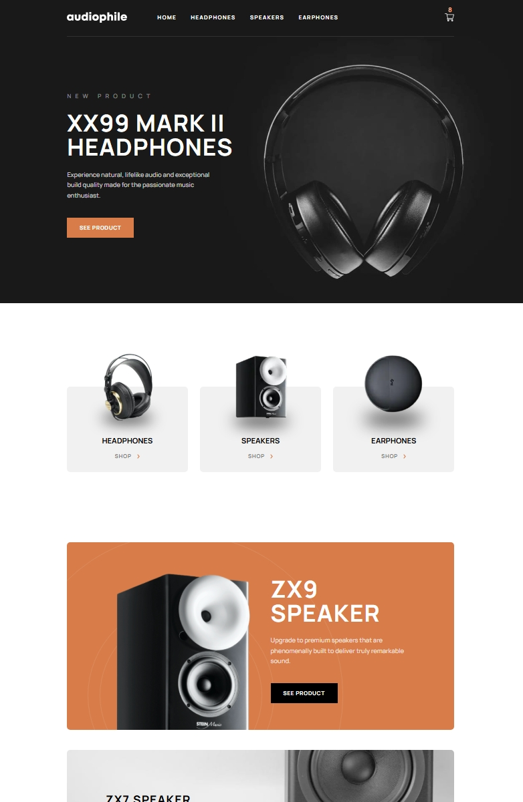

# Audiophile E-commerce Website

This is a fully responsive e-commerce platform for premium audio products, built with **Next.js**, **Tailwind CSS**, **PostgreSQL**, **Prisma**, **React Hook Form**, **Jest**, and **React Testing Library**.

Designed with performance, accessibility, and clean UI principles in mind, the site delivers a seamless and engaging shopping experience across all devices. Key features include:

- **Server-side rendered product pages** backed by a scalable database

- A persistent **shopping cart** using `localStorage` for client-side state

- An **accessible, validated checkout form** with thoughtful UX details

This project emphasizes scalability, type safety, and inclusive design practices to create an accessible and robust online storefront.

## Table of contents

- [Overview](#overview)
  - [The challenge](#the-challenge)
  - [Screenshot](#screenshot)
  - [Links](#links)
- [My process](#my-process)
  - [Built with](#built-with)
  - [Project structure](#project-structure)
  - [Build strategy](#build-strategy)
  - [Continued development](#continued-development)
  - [Useful resources](#useful-resources)
- [Acknowledgments](#acknowledgments)
- [Author](#author)

## Overview

### The challenge

Design and implement a fully functional e-commerce platform that showcases premium audio products with an emphasis on performance, accessibility, and clean UI/UX. The goal was to simulate a real-world online storefront experience, incorporating:

- **Dynamic server-side rendering** for SEO and data freshness

- **Persistent cart functionality** using `localStorage`

- **Responsive layouts** across all devices and screen sizes

- **Accessible checkout flow**, including semantic markup and form validation

This project challenged me to balance aesthetic design with performance optimization and inclusive user experience—all while applying modular, type-safe architecture with Next.js, Tailwind CSS, and Prisma.

### Screenshots




### Links

- Solution URL: [GitHub repo](https://github.com/BlackiePearlJoobi/audiophile-ecommerce-website.git)
- Live Site URL: [Vercel](https://audiophile-ecommerce-website-bice.vercel.app/)

## My process

### Built with

- **Next.js** – for server-side rendering and dynamic routing
- **TypeScript** – ensuring type safety and scalable logic
- **Tailwind CSS** – utility-first framework for responsive, accessible UI design
- **Prisma + Neon (PostgreSQL)** – scalable, cloud-hosted database with type-safe querying and remote deployment support
- **React (Context API, `useState`, `useEffect`)** – component-level logic and global state management
- **React Hook Form** – streamlined form management with built-in validation and accessibility support
- **Semantic HTML + ARIA (`role="region"`, `aria-labelledby`)** – enhancing structure and accessibility for assistive technologies
- **LocalStorage** – client-side persistence for shopping cart state
- **Jest + React Testing Library** - unit and integration testing for form validation, context-driven UI, and accessibility checks; includes parameterized tests for inputs and simulated user flows
- **Vercel** – intended deployment platform for seamless CI/CD and optimized performance

### Project structure

This project follows a modular structure leveraging **Next.js App Router**, with clear separation of concerns between layout, data, components, and styling. Below is a breakdown of key folders and files:

<pre>
app/
├── __tests__ // Unit and integration test suite for form validation, accessibility, and UI logic
├── [category]/ // Dynamic routes for product categories (e.g., headphones, speakers)
│ └── [slug]/ // Dynamic product detail pages rendered server-side
├── checkout/ // Checkout form with validation and order summary
├── components/ // Reusable UI components: `Header`, `Nav`, `Cart`, `Footer`, `AddToCartButton`, `Confirmation`, etc.
├── fonts/ // Custom font imports and configurations
├── types/definitions.ts // Shared TypeScript types and interfaces
├── CartContext.tsx // Global cart state managed via Context API
├── data.json // Static product data used for prototyping
├── global.css // Tailwind base styles and custom overrides
├── layout.tsx // Global layout wrapper including `Header` and `Footer`, and top-level `CartContext` provider for state management
├── page.tsx // Homepage layout and featured products
└── prisma-db.ts // Prisma client instance for safe, efficient DB access

prisma/
├── schema.prisma // Prisma schema defining PostgreSQL models and remote Neon database connection
└── seed.ts // Seed script to populate the Neon database with initial product data

__mock__/next/navigation.ts // Mock implementation of Next.js routing utilities for test isolation

public/assets/ // Static image assets used throughout the site
</pre>

### Build strategy

This project was developed with a focus on performance, accessibility, and maintainable architecture. I adopted a modular approach using **Next.js App Router**, integrating server-side rendering for product pages while managing cart state globally with the **Context API**. Key strategies included:

1.  Structuring routes dynamically under `app/[category]/[slug]` for clean, scalable navigation

2.  Leveraging **Prisma with Neon (PostgreSQL)** for scalable, type-safe querying and seamless integration in serverless environments

3.  Persisting cart state managed with both `localStorage` and React's `CartContext` for seamless UX across sessions

4.  Using **React Hook Form** with semantic HTML and ARIA for an accessible, user-friendly checkout experience

5.  Unit and integration tests via **Jest** and **React Testing Library**

#### 1. Dynamic Routing with App Router

The directory structure `app/[category]/[slug]` allows for intuitive and scalable routing. Each product category (e.g., headphones, speakers) and corresponding item pages are generated dynamically using `generateStaticCategoryParams` and `generateStaticSlugParams`, ensuring SEO benefits and clean URL architecture without hardcoding routes.

(Example:`prisma-db.ts`)

```ts
// for URL validation in app/[category]
export async function generateStaticCategoryParams() {
  // target the category table (model Category)
  // select only the name field (ignore id or other fields)
  // return an array like: [{ name: "headphones" }, { name: "speakers" }, { name: "earphones" }]
  const uniqueCategories = await prisma.category.findMany({
    select: { name: true },
  });

  /* transform the array into the shape Next.js expects for route generation: [
     { category: "headphones" },
     { category: "speakers" },
     { category: "earphones" }
   ]
  */
  return uniqueCategories.map(({ name }) => ({ category: name }));
}
```

(Example:`app/[category]/page.tsx`)

```tsx
const CategoryPage = async ({ params }: { params: { category: string } }) => {
  // URL validation
  const validParams = await generateStaticCategoryParams();
  // it will generate an array like:
  /* [
    { category: "headphones" },
    { category: "speakers" },
    { category: "earphones" }
  ] */
  const validCategories = validParams.map((param) => param.category);
  if (!validCategories.includes(params.category)) notFound();

  return (
    <>
      ...
      <div className="w-full h-[102px]...">
        <h1 className="text-[28px]...">{params.category}</h1>
      </div>
      ...
    </>
  );
};
```

By leveraging `generateStaticCategoryParams` from `prisma-db.ts`, I ensured that only valid category names are routed and rendered at build time, improving performance and SEO. This also prevents invalid URLs from being rendered, thanks to server-side guards using `notFound()`.

This dynamic routing pattern not only keeps the codebase scalable but aligns tightly with how the category data is stored in the database — providing a seamless full-stack connection between the URL, DB schema, and rendered page.

#### 2. Prisma + Neon (PostgreSQL) for Data Modeling

I chose **Prisma** for its type-safe ORM capabilities, enabling expressive data modeling and seamless integration with a relational database. The project began with **SQLite** for rapid local prototyping, and later transitioned to **Neon (PostgreSQL)** — a scalable, cloud-hosted solution ideal for serverless environments. Prisma’s autogenerated types ensured consistency across data access and component rendering, even during this transition.

The `schema.prisma` file models relationships between entities like `Product`, `Category`, `ProductImage`, `RelatedProduct`, etc., enabling nested querying and simplified type-safe fetching throughout the app.

(Example:`prisma/schema.prisma`)

```prisma
model Product {
  id            Int       @id @default(autoincrement())
  slug          String    @unique
  name          String
  new           Boolean
  price         Int
  description   String
  features      String
  category      Category  @relation(fields: [categoryId], references: [id])
  categoryId    Int
  image         ProductImage  @relation(fields: [imageId], references: [id])
  imageId       Int          @unique
  categoryImage CategoryImage?
  gallery       Gallery?
  includes      IncludeItem[]
  others        RelatedProduct[]

  @@map("products")
}

model Category {
  id       Int       @id @default(autoincrement())
  name     String    @unique
  products Product[]
}

model ProductImage {
  id        Int     @id @default(autoincrement())
  mobile    String
  tablet    String
  desktop   String
  product   Product?
}

...

model RelatedProduct {
  id           Int     @id @default(autoincrement())
  slug         String
  category     String
  name         String
  mobile       String
  tablet       String
  desktop      String
  product      Product @relation(fields: [productId], references: [id])
  productId    Int
}
```

To populate the database, I wrote a custom seeding script (`prisma-ts`) that parses structured product data from `data.json` and creates deeply nested records—including category relationships, media assets, feature lists, and upsell products.

(Example:`prisma/seed.ts`)

```ts
import { PrismaClient } from "../app/generated/prisma/index.js";
import { fileURLToPath } from "node:url";
import { join } from "node:path";
import { readFileSync } from "node:fs";

// convert the current module’s URL (import.meta.url) to a file path
const __dirname = fileURLToPath(new URL(".", import.meta.url));

// read the contents of ../app/data.json synchronously as UTF-8 text
const raw = readFileSync(join(__dirname, "../app/data.json"), "utf-8");

const products = JSON.parse(raw);
const prisma = new PrismaClient();

async function seedProducts() {
  const existing = await prisma.product.findFirst();
  if (existing) {
    console.log("Products already seeded. Skipping...");
    return;
  }

  for (const product of products) {
    await prisma.product.create({
      data: {
        slug: product.slug,
        name: product.name,
        new: product.new,
        price: product.price,
        description: product.description,
        features: product.features,
        category: {
          connectOrCreate: {
            where: { name: product.category },
            create: { name: product.category },
          },
        },
        image: {
          create: product.image,
        },
        categoryImage: {
          create: product.categoryImage,
        },
        gallery: {
          create: {
            first: { create: product.gallery.first },
            second: { create: product.gallery.second },
            third: { create: product.gallery.third },
          },
        },
        includes: {
          create: product.includes.map(
            (item: { quantity: number; item: string }) => ({
              quantity: item.quantity,
              item: item.item,
            }),
          ),
        },
        others: {
          create: product.others.map(
            (related: {
              slug: string;
              category: string;
              name: string;
              image: {
                mobile: string;
                tablet: string;
                desktop: string;
              };
            }) => ({
              slug: related.slug,
              category: related.category,
              name: related.name,
              mobile: related.image.mobile,
              tablet: related.image.tablet,
              desktop: related.image.desktop,
            }),
          ),
        },
      },
    });
  }
}

seedProducts()
  .then(() => {
    console.log("Seeding complete.");
    return prisma.$disconnect();
  })
  .catch((error) => {
    console.error("Error seeding:", error);
    return prisma.$disconnect();
  });
```

This script now seeds a Neon-hosted Postgres database via Prisma’s remote connection.

(Example:`app/prisma-ts`)

```ts
import { PrismaClient } from "./generated/prisma";

const prisma = new PrismaClient();

export async function getProducts() {
  return prisma.product.findMany({
    orderBy: [
      { price: "desc" }, // sort high to low first
      { new: "desc" }, // then place new products first
    ],
    include: {
      // define which relations to include
      category: true,
      categoryImage: true,
    },
  });
}
```

The `getProducts()` utility function encapsulates product fetching, returning server-rendered, sorted results enriched with category and image relations — used across category pages renders.

(Example:`app/[category]/[slug]/page.tsx`)

```tsx
const ProductPage = async ({
  params,
}: {
  params: { category: string; slug: string };
}) => {
  const product: Product = (await getProduct(params.slug)) ?? notFound();

  return (
    <>
      ...
      <main className="mx-[24px]...">
        <section className="flex...">
          {product.image && (
            <picture>
              <source
                srcSet={product.image.desktop}
                media="(min-width: 1024px)"
                width={540}
                height={560}
              ></source>
              <source
                srcSet={product.image.tablet}
                media="(min-width: 640px)"
                width={281}
                height={480}
              ></source>
              <Image
                src={product.image.mobile}
                width={327}
                height={327}
                alt="category image"
                className="w-full..."
              ></Image>
            </picture>
          )}
          <article className="flex...">
            {product.new && <span className="text-[14px]...">NEW PRODUCT</span>}
            <h1 className="text-[28px]...">{product.name}</h1>
            <p className="text-[15px]...">{product.description}</p>
            <span className="text-[18px]...">
              $ {product.price.toLocaleString("en-US")}
            </span>
            <AddToCartButton product={cartInfo}></AddToCartButton>
          </article>
        </section>
        ...
      </main>
    </>
  );
};
```

By tightly coupling **Prisma’s relational modeling** with reusable query utilities like `getProducts()` and clean dynamic routes, the backend structure remained both **scalable and type-safe**.

This approach significantly reduced bugs, avoided data mismatches in components, and allowed me to confidently render server-side pages with deeply nested product data—all from a single source of truth.

#### 3. Persistent Cart with Context API + LocalStorage

To manage cart state globally, I used React’s **Context API**, wrapping the entire app inside a `<CartProvider>` in `layout.tsx`. This allowed all components — like the shopping cart, checkout summary, and order confirmation modal — to access and modify cart data without prop drilling.

(Example:`app/CartContext.tsx`)

```tsx
"use client";

import { createContext, useContext, useEffect, useMemo, useState } from "react";
import type { CartItem, CartTotal } from "./types/definitions";

interface CartContextType {
  cartItems: { [key: number]: CartItem };
  activeCartItems: { [key: number]: CartItem };
  cartTotal: CartTotal;
  updateCart: (productId: number, item: CartItem) => void;
  clearCart: () => void;
}

const CartContext = createContext<CartContextType | undefined>(undefined);

export const CartProvider = ({ children }: { children: React.ReactNode }) => {
  // all cart items including those whose amount is 0 (deleted from the cart)
  // use it to edit the content of the cart
  const [cartItems, setCartItems] = useState<{ [key: number]: CartItem }>({});

  // cart items whose amount is more than 0
  // only use it to reference, do not to directly add/remove a product from it
  const activeCartItems = useMemo(
    () => Object.values(cartItems).filter((product) => product.amount > 0),
    [cartItems],
  );

  const cartTotal = useMemo(() => {
    const totalAmount = activeCartItems.reduce((sum, p) => sum + p.amount, 0);
    const totalPrice = activeCartItems.reduce(
      (sum, p) => sum + p.amount * p.price,
      0,
    );
    const SHIPPING = totalAmount ? 50 : 0;
    const VAT = Math.floor(totalPrice * 0.2);
    const grandTotal = totalPrice + SHIPPING + VAT;

    return { totalAmount, totalPrice, SHIPPING, VAT, grandTotal };
  }, [activeCartItems]);

  // load from localStorage once on mount
  useEffect(() => {
    try {
      const storedCart = localStorage.getItem("cart");
      if (storedCart) setCartItems(JSON.parse(storedCart));
    } catch (e) {
      console.error("Error loading cart from localStorage:", e);
    }
  }, []);

  // sync to localStorage on every cart update
  useEffect(() => {
    try {
      localStorage.setItem("cart", JSON.stringify(cartItems));
    } catch (e) {
      console.error("Error saving cart to localStorage:", e);
    }
  }, [cartItems]);

  const updateCart = (productId: number, item: CartItem) => {
    setCartItems((prevCart) => {
      return {
        ...prevCart,
        [productId]: item,
      };
    });
  };

  const clearCart = () => {
    setCartItems({});
  };

  return (
    <CartContext.Provider
      value={{ cartItems, activeCartItems, cartTotal, updateCart, clearCart }}
    >
      {children}
    </CartContext.Provider>
  );
};

// Reusable custom hook for using the Cart context
export const useCart = () => {
  const context = useContext(CartContext);
  if (!context) throw new Error("useCart must be used within a CartProvider");
  return context;
};
```

(Example:`app/layout.tsx`)

```tsx
import { CartProvider } from "./CartContext";
import Header from "./components/Header";
import Footer from "./components/Footer";

export default function RootLayout({
  children,
}: Readonly<{
  children: React.ReactNode;
}>) {
  return (
    <html lang="en">
      <body className="antialiased">
        <div className="w-full flex flex-col">
          <CartProvider>
            <Header></Header>
            <div className="max-w-[1440px] w-full flex flex-col mx-auto">
              {children}
            </div>
            <Footer></Footer>
          </CartProvider>
        </div>
      </body>
    </html>
  );
}
```

I also implemented a **custom hook** `useCart` to encapsulate context access and improve DX. This ensures type-safe access to cart operations (`updateCart`, `clearCart`) and read-only data (`cartItems`, `activeCartItems`, etc.) throughout the app.

To persist state across sessions, I synchronized cart data with `localStorage`, initializing it on mount and updating it on change via `useEffect`. The app hydrates correctly and avoids flicker by loading stored data client-side before the cart becomes interactive.

A derived state, `cartTotal`, memoizes subtotal, shipping cost, VAT, and grand total — keeping all pricing logic centralized and consistent across the cart, checkout summary, and order confirmation modal.

(Example:`app/components/Cart.tsx`)

```tsx
import { useCart } from "../CartContext";

const Cart = () => {
  const { cartItems, activeCartItems, cartTotal, updateCart, clearCart } =
    useCart();

  return (
    <>
      ...
      <ul className="my-[32px]...">
        {Object.values(activeCartItems).map((product) => (
          <li key={product.id} className="flex flex-row items-center">
            ...
            <div className="ml-[16px]...">
              <span className="text-[15px]...">{product.name}</span>
              <span className="text-[14px]...">
                $ {product.price.toLocaleString("en-US")}
              </span>
            </div>
            <div className="ml-auto...">
              <button
                type="button"
                className="text-[13px]..."
                onClick={() =>
                  updateCart(product.id, {
                    ...cartItems[product.id],
                    amount: Math.max(product.amount - 1, 0),
                  })
                }
              >
                -
              </button>
              <span className="text-[13px]...">{product.amount}</span>
              <button
                type="button"
                className="text-[13px]..."
                onClick={() =>
                  updateCart(product.id, {
                    ...cartItems[product.id],
                    amount: product.amount + 1,
                  })
                }
              >
                +
              </button>
            </div>
          </li>
        ))}
      </ul>
      <div className="mb-[24px]...">
        <span className="text-[15px]...">TOTAL</span>
        <span className="text-[18px]...">
          $ {cartTotal.totalPrice.toLocaleString("en-US")}
        </span>
      </div>
      ...
    </>
  );
};
```

This architecture keeps the cart logic clean, composable, and responsive—balancing interactivity with state predictability and accessible UX.

#### 4. Accessible Forms with React Hook Form

The checkout form was built with **React Hook Form** to manage form state, validation, and submission while maintaining minimal re-renders and clean field registration. I paired this with **semantic HTML** and `aria-labelledby` to create an accessible experience optimized for keyboard and screen reader users.

Key accessibility and validation strategies included:

- Grouped inputs using `<fieldset>` and `<legend>` to preserve logical structure and assistive tech semantics

(Example:`app/checkout/page.tsx`)

```tsx
import { useForm } from "react-hook-form";

const Checkout = () => {
  const {
    register,
    handleSubmit,
    formState: { errors },
    setValue,
  } = useForm<FormValues>();

  // submit function (prop) passed to <Summary>'s payment button
  const submitOrder = () => {
    formRef.current?.requestSubmit();
  };

  return (
    ...
    <main className="mb-[97px]...">
        <form
          ref={formRef}
          className="mx-[24px]..."
          onSubmit={handleSubmit(onSubmit)}
        >
          <h1 className="text-[28px]...">
            CHECKOUT
          </h1>
          <fieldset>
            <legend className="text-[13px]...">
              BILLING DETAILS
            </legend>
            <ul className="flex...">
              <li className="flex...">
                <div className="flex...">
                  <label
                    htmlFor="name"
                    className="text-[12px]..."
                  >
                    Name
                  </label>
                  {typeof errors.name?.message === "string" && (
                    <span className="text-[12px]...">
                      {errors.name?.message}
                    </span>
                  )}
                </div>
                <input
                  type="text"
                  id="name"
                  {...register("name", {
                    required: "This is required",
                  })}
                  autoComplete="name"
                  placeholder="Alexei Ward"
                  className="w-full..."
                ></input>
              </li>
              ...
            </ul>
          </fieldset>
          ...
        </form>
        <Summary submitOrder={submitOrder}></Summary>
    </main>
    ...
  );
};
```

- Screen-reader friendly markup in the summary section, using `<table>` with offscreen `<span>` in `<h2>`, `<caption>`, and `<thead>`, as well as properly scoped headers (<th scope="row">)

(Example:`app/components/Summary.tsx`)

```tsx
const Summary = ({ submitOrder }: SummaryProps) => {
  const { activeCartItems, cartTotal } = useCart();

  return (
    <section className="h-full...">
      <h2 id="summary-heading" className="text-[18px]...">
        <span className="sr-only">ORDER </span>SUMMARY
      </h2>
      ...
      <table aria-labelledby="summary-heading">
        <caption className="sr-only">Payment Details</caption>
        <thead className="sr-only">
          <tr>
            <th scope="col">Charge Type</th>
            <th scope="col">Price</th>
          </tr>
        </thead>
        <tbody>
          <tr>
            <th scope="row" className="text-[15px]...">
              TOTAL
            </th>
            <td className="text-[18px]...">
              $ {cartTotal.totalPrice.toLocaleString("en-US")}
            </td>
          </tr>
          <tr>
            <th scope="row" className="text-[15px]...">
              SHIPPING
            </th>
            <td className="text-[18px]...">$ {cartTotal.SHIPPING}</td>
          </tr>
          <tr>
            <th scope="row" className="text-[15px]...">
              VAT &#40;INCLUDED&#41;
            </th>
            <td className="text-[18px]...">
              $ {cartTotal.VAT.toLocaleString("en-US")}
            </td>
          </tr>
        </tbody>
        <tfoot>
          <tr>
            <th scope="row" className="text-[15px]...">
              GRAND TOTAL
            </th>
            <td className="text-[18px]...">
              $ {cartTotal.grandTotal.toLocaleString("en-US")}
            </td>
          </tr>
        </tfoot>
      </table>
      ...
    </section>
  );
};
```

- Real-time validation and error messaging driven by `formState.errors`, improving feedback clarity

- **Regex-powered input validation**, including:
  - Email: `/^\w+([.-]?\w+)*@\w+([.-]?\w+)*\.\w{2,}$/i` to enforce valid address structure
  - Zip code: `/^[1-9]{5}(-[0-9]{4})?$/` to match US ZIP and ZIP+4 formats

I also added live formatting for phone numbers via a custom `formatPhone()` utility, ensuring consistent UX while supporting manual correction and backspacing — crucial for usability.

(Example:`app/checkout/page.tsx`)

```tsx
const Checkout = () => {
  const formatPhone = (value: string) => {
    const digits = value.replace(/\D/g, "").slice(0, 10); // allow only 10 digits
    const len = digits.length;

    if (len === 0) return "";
    if (len <= 3) return `(${digits}`;
    if (len <= 6) return `(${digits.slice(0, 3)}) ${digits.slice(3)}`;
    return `(${digits.slice(0, 3)}) ${digits.slice(3, 6)} ${digits.slice(6)}`;
  };

  return (
    ...
    <input
        type="tel"
        id="phone"
        {...register("phone_number", {
          required: "This is required",
          pattern: {
            value: /^\(\d{3}\) \d{3} \d{4}$/,
            message: "Wrong format",
          },
          // Live formatting
          // Respect user backspace — so they can delete chars without re-injection immediately
          onChange: (e) => {
            const prev = e.target.value;
            const next = formatPhone(prev);
            if (next !== prev) {
                setValue("phone_number", next);
            }
          },
        })}
        autoComplete="tel"
        placeholder="(202) 555-0136"
        className="w-full..."
    ></input>
    ...
  );
};
```

The form is **fully keyboard-navigable**, screen reader-friendly, and respects user expectations around focus management, validation hints, and assistive labeling—all without relying on third-party UI frameworks.

This approach reflects my ongoing commitment to building inclusive, human-centered interfaces that don’t compromise on performance or flexibility.

#### 5. Unit and integration tests with Jest and React Testing Library

This project includes a comprehensive suite of form validation tests for the checkout flow. Tests assert both failure and success scenarios using:

- **Jest** for test orchestration and mocking

- **React Testing Library** for DOM queries scoped by accessibility

- `test.each()` for coverage across multiple input variants

The confirmation modal is only rendered when `activeCartItems.length > 0`, verified via tests that simulate a valid cart state.

##### Setting up

- `npm install -D jest jest-environment-jsdom @testing-library/react @testing-library/dom @testing-library/jest-dom ts-node @types/jest`

- `npm install --save-dev ts-jest`

- `npm install --save-dev @testing-library/user-event`

- `npm init jest@latest`

- `jest.config.ts`

```ts
import type { Config } from "jest";
import nextJest from "next/jest";

const createJestConfig = nextJest({
  dir: "./",
});

const config: Config = {
  testEnvironment: "jsdom",
  clearMocks: true,
  collectCoverage: true,
  collectCoverageFrom: ["app/**/*.{ts,tsx}", "!app/**/*.d.ts"],
  coverageDirectory: "coverage",
  setupFilesAfterEnv: ["<rootDir>/setupTests.ts"],
  moduleNameMapper: {
    "^@/(.*)$": "<rootDir>/$1",
  },
};

export default createJestConfig(config);
```

- In the root directory, create `setupTests.ts` and add the following to it:

```ts
import "@testing-library/jest-dom";
```

- In `tsconfig.json`, add the following:

```json
  "compilerOptions": {
    "types": ["jest", "@testing-library/jest-dom"],
    "jsx": "react-jsx"
  }
```

- In the root directory, create `__mock__/next` folders and `navigation.ts` in it, and add the following to it:

```ts
export const useRouter = () => ({
  back: jest.fn(),
  push: jest.fn(),
  forward: jest.fn(),
  replace: jest.fn(),
  prefetch: jest.fn(),
});
```

- then add the following at the top of test files:

```tsx
jest.mock("next/navigation", () => ({
  useRouter: () => ({
    back: jest.fn(),
    push: jest.fn(),
    forward: jest.fn(),
    replace: jest.fn(),
    prefetch: jest.fn(),
  }),
}));
```

##### Mocking CartContext in Tests

To isolate checkout behaviors from global state, `CartContext` is mocked using Jest to simulate a filled cart:

```tsx
// checkout.test.tsx

jest.mock("../CartContext", () => ({
  useCart: () => ({
    cartItems: {
      1: { id: 1, name: "YX1 Wireless Earphones", price: 599, amount: 1 },
    },
    activeCartItems: [
      { id: 1, name: "YX1 Wireless Earphones", price: 599, amount: 1 },
    ],
    cartTotal: {
      totalAmount: 1,
      totalPrice: 599,
      SHIPPING: 50,
      VAT: 119,
      grandTotal: 768,
    },
    updateCart: jest.fn(),
    clearCart: jest.fn(),
  }),
  CartProvider: ({ children }: { children: React.ReactNode }) => children,
}));
```

This mock enables tests to:

- Trigger the confirmation modal (`<Confirmation />`) only when `activeCartItems.length > 0`

- Assert submission behaviors without relying on `localStorage` hydration

- Spy on `updateCart` and `clearCart` when needed for interaction tests

##### Format Validation Tests

Robust form validation is implemented using **React Hook Form**, with coverage provided by **Jest** and **Testing Library**. Email and phone number field formats are tested dynamically using `test.each()`:

```tsx
// checkout.test.tsx

test.each([
  ["bademail@", true],
  ["example@mail.c", true],
  ["user.com", true],
  ["test@example.com", false],
])("email '%s' should %s trigger error", async (input, shouldError) => {
  await userEvent.type(emailInput, input);
  await userEvent.click(payButton);
  const error = within(emailField).queryByText(/wrong format/i);
  expect(!!error).toBe(shouldError);
});
```

This test iterates through common failure cases and asserts whether a format error is correctly shown. It ensures consistent behavior across multiple input variants and strengthens confidence in user-facing validation logic.

### Continued Development

While this project fulfills its current scope, there are several areas I plan to expand or optimize in future iterations:

- **Internationalization (i18n)**: Support additional currencies, localized date/number formatting, and translations to accommodate a broader user base.

- **Enhanced Form Accessibility**: Add ARIA live regions for error announcements and robust focus management for modals and dynamic sections.

These improvements align with my long-term goals of building inclusive, scalable systems that prioritize real-world usability and ethical design standards.

### Useful Resources

- [Next.js 15 Full Tutorial Playlist – Codevolution](https://www.youtube.com/playlist?list=PLC3y8-rFHvwhIEc4I4YsRz5C7GOBnxSJY) - This comprehensive series covers everything from routing to data fetching in the App Router era. Two standout episodes that directly influenced this project:

  - [Episode 8 – Nested Dynamic Routes](https://www.youtube.com/watch?v=edrJf0GKfAI) helped shape the structure of `app/[category]/[slug]` and clarified how to model deeply nested layouts and route segments.

  - [Episode 72 – Fetching from a Database](https://www.youtube.com/watch?v=IUeSwzvz9i4) guided the integration of **Prisma with SQLite**, including model creation, seeding, and server-side data fetching in React Server Components. I later migrated to Neon (PostgreSQL) for production deployment.

- [Tailwind CSS Cheat Sheet – Nerdcave](https://nerdcave.com/tailwind-cheat-sheet) - A handy reference for utility classes, invaluable for building responsive layouts and fine-tuning spacing and typography.

- [An Introduction to React’s Context API – Smashing Magazine](https://www.smashingmagazine.com/2020/01/introduction-react-context-api/) - A clear, practical guide to Context API that helped shape my cart state architecture and avoid prop drilling.

## Acknowledgments

This is a solution to the [Audiophile e-commerce website challenge on Frontend Mentor](https://www.frontendmentor.io/challenges/audiophile-ecommerce-website-C8cuSd_wx). Frontend Mentor challenges help you improve your coding skills by building realistic projects.

## Author

- Frontend Mentor - [@BlackiePearlJoobi](https://www.frontendmentor.io/profile/BlackiePearlJoobi)
- devChallenges - [@Moonychan](https://devchallenges.io/profile/568d1c62-28c2-40d3-8772-cce03ae0c707)
